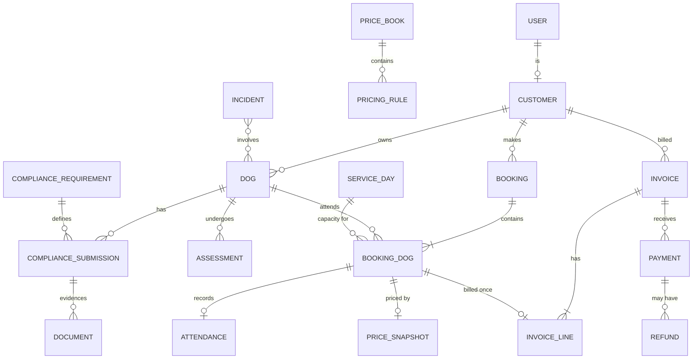

# LunaK9 Club Platform — Discovery (Phase 0)

> **Update 26 Sep 2026:** Owner answers recorded in `docs/decisions.md`; billing model revised in `docs/adr/0002-billing-model.md` (memberships billed in advance, ad hoc paid at booking). Where §6 differs, the decision log wins.

> Status: **Draft for approval** · Prepared 26 Sep 2026 · Nothing here is implemented yet.
> Every item marked **[PROVISIONAL]** is a default that must be approved before it is built.

Repository inspection: `LunaK9Club-Platform` is currently empty (no files, no git history). This is a greenfield build, so the baseline stack below is not constrained by existing code.

---

## 1. Understanding of the product

A single-business (not multi-tenant SaaS) web platform for a UK doggy daycare, working name **LunaK9 Club**, that replaces spreadsheets, messaging and manual invoicing with one system of record.

| Module | What it does | Who uses it |
|---|---|---|
| **Booking & attendance** | Calendar availability, capacity-safe bookings for one or more dogs, waitlist, check-in/out, no-shows | Customers (self-serve), staff (day operations) |
| **Invoicing & payments** | Priced, explainable bookings rolled into one monthly invoice per customer, PDF + Stripe payment link, ledger and reconciliation | Customers (view/pay), owner/finance (review, send, chase) |
| **Compliance & welfare** | Dog profiles, vaccination evidence, assessments, booking gates, expiry reminders, incidents, audit, privacy workflows | Customers (upload/declare), staff/compliance reviewer |

The core loop:

```
Register → add dog → upload vaccinations → meet-and-greet/trial → approved
   → book dates (price shown) → attend (check-in/out) → month-end invoice
   → pay via Stripe → ledger reconciled → reminders for expiring documents
```

What makes this harder than it looks:

1. **Capacity is a hard safety limit**, not a soft target (licence conditions and staff ratios), so overbooking must be impossible under concurrency.
2. **Price depends on other bookings** (weekly tiers), so a day's price is not final when booked; it becomes final at invoicing. Customers must still see an honest estimate.
3. **Money and compliance records are immutable history** — edits to price books, dogs or policies must never rewrite past invoices or past approvals.
4. **Sensitive-in-context data** (medical, behaviour, bite history, authorised collectors) needs least-privilege access and minimal exposure in email.

## 2. Key assumptions and risks

### Assumptions [PROVISIONAL]

| # | Assumption |
|---|---|
| A1 | One business, one site. No multi-location or franchise support at launch (schema keeps a `site_id` seam only if you confirm a second site is plausible). |
| A2 | Bookings are **whole calendar days** in `Europe/London`, stored as SQL `date`, not timestamps. Check-in/out times are timestamps (UTC). |
| A3 | Weekly tier = **per dog, per ISO week (Mon–Sun)**, counting confirmed, non-cancelled days. |
| A4 | Billing is **postpaid monthly**; the tier for a day is finalised at invoicing, not at booking. |
| A5 | Admin reviews every draft invoice before it is sent (no auto-send at launch). |
| A6 | Not VAT-registered at launch; VAT support exists but is switched off. |
| A7 | Customers are adults acting as consumers; B2B/corporate accounts are out of scope. |
| A8 | Stripe UK account available; cards + Apple Pay/Google Pay via Checkout at launch. |
| A9 | Hosting in a UK/EU region for all personal data. |

### Risks

| Risk | Impact | Mitigation |
|---|---|---|
| **Pricing ambiguity:** reference model has £50 "ad hoc" and £48 "1–3 days/week" — a single day in a week matches both. | Wrong invoices, disputes | Q2 below; recommend 1 day = £50, 2–3 = £48, 4–5 = £45. Pricing engine is rule-driven so either reading is config, not code. |
| Weeks straddling month-end (e.g. Mon 29 Sep – Sun 5 Oct). | Tier computed on incomplete data | Tier always computed over the full ISO week from confirmed bookings at invoice run time; late cancellations after invoicing produce a credit/adjustment on the next invoice, never a rewrite. |
| Overbooking under concurrent requests | Licence breach, welfare risk | Row-level lock on a per-day capacity row inside one transaction + DB constraint tests with parallel clients. |
| Double charging (duplicate jobs/webhooks) | Financial/trust harm | Unique constraints on `(booking_dog_id)` in invoice lines, idempotency keys on Stripe calls, webhook event table keyed by Stripe event id. |
| Staff-to-dog ratio vs. fixed capacity | Capacity set too high on short-staffed days | Capacity per date = min(licensed maximum, configured override); staff ratio modelled as a warning at launch (Q5). |
| Scope creep (grooming, taxi, memberships) | Delayed launch | Launch set fixed in Q10; everything else behind feature flags. |
| Legal/tax conclusions baked into code | Non-compliance | All retention periods, VAT and cancellation terms are config; flagged for accountant/solicitor review (§7). |
| Email deliverability of invoices | Unpaid invoices | Verified sending domain (SPF/DKIM/DMARC), delivery status stored, portal is the source of truth. |
| Single developer/operator knowledge | Bus factor | CLAUDE.md, ADRs, runbooks, seed data and reproducible local env from day one. |

### Points needing UK professional advice (not legal conclusions)

- **Licensing:** dog day care in England is a licensable activity under the Animal Welfare (Licensing of Activities Involving Animals) (England) Regulations 2018; the local-authority licence conditions and statutory guidance drive record-keeping, vaccination, staff ratio and maximum-dog rules. Confirm your licence's exact conditions (and nation — Wales/Scotland differ).
- **VAT:** registration threshold and invoice content — accountant.
- **Record retention:** financial records (commonly 6 years), incident/insurance records, and personal-data retention periods — accountant/insurer/solicitor.
- **Terms & conditions / cancellation fees:** consumer contract and unfair-terms rules — solicitor.
- **UK GDPR:** ICO data-protection fee, privacy notice, lawful basis per field, processor agreements with Stripe/email/hosting providers.

## 3. Recommended architecture and why

| Concern | Recommendation | Why |
|---|---|---|
| App | **Next.js (App Router) + TypeScript strict**, server actions + route handlers | One deployable, server-side auth checks close to data, strong ecosystem. |
| Domain layer | Plain TS modules in `src/domain/*` (pricing, capacity, billing, compliance) with no Next.js imports | Deterministic, unit-testable; framework can change. |
| DB | **PostgreSQL** (Neon or Supabase Postgres, London/EU region) | Transactions, row locks, check constraints, `date`/`tstzrange` types. |
| ORM | **Drizzle** + `drizzle-kit` generated SQL migrations, committed and reviewed | SQL-first: `SELECT … FOR UPDATE`, partial unique indexes and check constraints are first-class; migrations are readable SQL. (Prisma is an acceptable alternative if you prefer it.) |
| Auth | **Better Auth** (email+password, email verification, reset, rate limiting, sessions in our Postgres) behind an `AuthProvider` adapter | Keeps identity data in the UK/EU DB, no per-user fees, RBAC stays in our schema. Clerk is the managed alternative if you prefer zero auth ops. |
| RBAC | Roles + permission strings enforced in a single `authorize(actor, action, resource)` policy layer, called by every action/route/query helper | "Never rely on UI hiding" is enforced by construction and covered by authorisation tests. |
| Payments | **Stripe Checkout Sessions** created per invoice (our own invoice numbering), webhooks → `webhook_events` → ledger | Keeps HMRC-style sequential numbering and PDFs under our control; Stripe remains payment source of truth. |
| Email | **Resend** (or Postmark) + React Email templates behind `EmailProvider` | Simple API, sandbox mode, delivery webhooks. |
| Files | **S3-compatible storage** (AWS S3 eu-west-2 or Cloudflare R2 EU), private buckets, 5-minute signed URLs issued only after an authorisation check | Documents never publicly addressable. |
| Jobs | **DB-backed job/outbox tables** + scheduled trigger (Vercel Cron or platform cron) calling idempotent job endpoints; one `job_runs` row per (job, period) with unique constraint | No extra vendor; idempotency lives in the database. Inngest/Trigger.dev can replace the runner via adapter if volume grows. |
| PDF | `@react-pdf/renderer` server-side, PDF stored with a content hash | Deterministic, reproducible invoices. |
| Hosting | **Vercel** (app) + Neon (DB) + S3/R2 — all UK/EU regions | Low ops; alternative: Fly.io/Render with Docker. |
| Testing | Vitest (unit/integration, Testcontainers Postgres), Playwright (E2E), axe-core (a11y) | Real Postgres in tests so locks/constraints are genuinely exercised. |
| CI | GitHub Actions: lint, typecheck, test, migration check, build, gitleaks, dependency audit | Quality gates per phase. |
| Observability | Structured logging with PII redaction (pino), Sentry (EU region) with scrubbing | No medical/payment data in logs. |
| Locale | `en-GB`, GBP, `Europe/London` via `date-fns-tz`; money as integer pence (`bigint`) | DST-safe; no floating-point money. |

Architecture sketch:

```
Browser ──► Next.js (RSC, server actions, route handlers)
               │  authorize() policy layer
               ▼
          src/domain  (pricing · capacity · billing · compliance)  ← pure TS, heavily tested
               │
          src/infra   (db/drizzle · stripe · email · storage · pdf · jobs)  ← adapters
               │
   Postgres ── S3/R2 ── Stripe ── Resend        Cron ─► /api/jobs/* (idempotent)
                                   Stripe ─► /api/webhooks/stripe (signature-verified)
```

## 4. Proposed data model (high level)

### Entity groups

- **Identity & access:** `users`, `sessions`, `accounts` (auth), `roles`, `user_roles`, `permissions`, `staff_profiles`
- **Customers & dogs:** `customers` (1:1 with a customer user), `dogs`, `dog_health_profiles` (restricted), `dog_behaviour_profiles` (restricted), `vets`, `contacts` (emergency/authorised collector), `dog_contacts`
  - *As built (4 Oct 2026, D68–D70):* licence register fields live on existing tables – treatment dates, exercise restrictions and insurance on `dog_health_profiles`; seven consents with `_at`/`_by` on `dog_permissions`; agreed emergency vet as `dogs.agreed_vet_id` → `vets`; vaccination date given on `compliance_submissions.administered_on`.
- **Compliance:** `compliance_requirements` (configurable: vaccine types, declarations, assessments), `compliance_submissions` (per dog × requirement, status, expiry), `documents` (storage key, hash, MIME, scan status), `assessments` (meet-and-greet, trial, outcome), `policy_versions`, `acknowledgements`, `compliance_overrides`
- **Availability & booking:** `opening_rules` (effective-dated weekly pattern), `closures`, `service_days` (one row per operating date: capacity, transport capacity, override reason, `version`), `services` (full day, half day, trial, taxi…), `bookings` (customer-level request), `booking_dogs` (one row per dog per date — the capacity unit), `attendance` (check-in/out, staff, notes), `waitlist_entries`, `booking_notes` (visibility: internal | customer)
- **Pricing:** `price_books` (effective-dated, versioned), `pricing_rules` (tier/consecutive/multi-dog/fees, JSON params validated by Zod), `customer_rates`, `promotions`, `quotes`, `price_snapshots` (rate, rule version, quantity, discount, tax, explanation)
- **Billing & payments:** `invoices`, `invoice_lines`, `invoice_number_sequence`, `credits`, `payments`, `refunds`, `payment_sessions`, `webhook_events`, `ledger_entries`
- **Welfare:** `incidents`, `incident_dogs`, `incident_actions`, `attachments`
- **Platform:** `notifications`, `notification_deliveries`, `audit_events`, `job_runs`, `outbox`, `settings`

### Core relationships



### Invariants the database will enforce

1. **No overbooking:** booking a dog-day locks `service_days` row `FOR UPDATE`, counts active `booking_dogs`, inserts only if below capacity — one transaction. Tested with N parallel clients racing for the last place.
2. **One dog, one place per day:** partial unique index on `booking_dogs(dog_id, service_date) WHERE status IN ('pending','confirmed','attended')`.
3. **Billed once:** unique `invoice_lines(booking_dog_id)` (for non-void invoices) — a dog-day cannot appear on two live invoices.
4. **Immutable financial history:** finalised invoices and their lines/snapshots are append-only (DB trigger rejects UPDATE on finalised rows; corrections are credits/adjustments).
5. **Sequential numbering:** invoice numbers assigned from a locked sequence row only on finalisation; gapless within a series; voids keep their number.
6. **Money:** all amounts `bigint` pence with `CHECK` constraints (e.g. line total = qty × unit − discount).
7. **Idempotency:** unique `webhook_events(stripe_event_id)`, unique `job_runs(job_name, period_key)`, unique `payment_sessions(invoice_id) WHERE active`.
8. **Ownership:** every customer-scoped table carries `customer_id`; query helpers require an actor and filter by it (plus authorisation tests per route).
9. **Effective dating:** `price_books` and `opening_rules` use non-overlapping date ranges (`EXCLUDE USING gist`).
10. **Optimistic locking:** `version` column on bookings, invoices, service days for admin edits.
11. **Timestamps** `timestamptz` in UTC; service dates are `date` interpreted in `Europe/London`.

## 5. Phased delivery plan

Each phase ends with: lint, typecheck, unit + integration tests, migrations applied from zero, relevant E2E, security checklist for the phase, `docs/progress.md` updated, demo notes.

| # | Phase | Scope | Acceptance criteria (summary) | Demo journey |
|---|---|---|---|---|
| 0 | **Discovery** (this doc) | PRD, journeys, ADRs, data model, risks, test strategy, questions | You approve defaults and answers | — |
| 1 | **Foundation** | Repo, pnpm, Next.js, Drizzle, Docker Postgres, auth (register/verify/reset), roles & policy layer, audit framework, design-system primitives, CI, `.claude/` setup, seed | Unauth'd and wrong-role access to every seeded route returns 401/403 (tests); CI green; `pnpm dev` from clean clone < 10 min using README | Register → verify → sign in; admin signs in and sees admin shell |
| 2 | **Customer & dog onboarding** | Customer profile, dogs, contacts, vets, document upload (private storage, signed URLs, type/size checks), requirements config, assessment records, admin review/approve/reject, policy acknowledgement | A customer cannot see or fetch another's dog/doc (tests); rejected doc shows reason; all approvals audited | Customer adds dog + vaccination cert → admin approves → dog "Approved" |
| 3 | **Booking MVP** | Opening rules, closures, service days, calendar (available/nearly full/full/closed/booked, with text/icons not colour alone), multi-date multi-dog booking, compliance gate, waitlist, cancel within rules, admin day/week/month views, check-in/out, no-show, exports, emails | Concurrency test: 50 parallel requests for last 2 places → exactly 2 succeed; expired vaccination blocks dates after expiry with a clear reason; cancellation cut-off enforced server-side | Customer books 3 days for 2 dogs; admin checks them in; full day shows waitlist |
| 4 | **Pricing** | Price books, rule engine (weekly tier; consecutive-day strategy available), fees, customer rates, promotions, quote breakdown before confirmation, snapshots, admin config with effective dates, `/review-pricing` | Pricing matrix (boundaries, straddling weeks, bank holidays, cancellations, DST weeks) passes; editing future prices leaves historic quotes unchanged | Customer sees "3 days × 2 dogs … £288 est." with explanation |
| 5 | **Billing** | Month-end job (preview → drafts), invoice review UI, credits/fees/notes, finalise + numbering, PDF, customer invoice portal, CSV export, `/run-month-end` | Running job twice creates no duplicates; every eligible dog-day billed exactly once; PDF matches ledger totals | Admin previews September, approves drafts, customer downloads PDF |
| 6 | **Payments** | Stripe Checkout per invoice, webhooks (signature, idempotent), receipts, partial payments, manual payments, refunds, reminders, aged debt, reconciliation report | Replayed/duplicated/out-of-order webhooks produce correct final state; test-mode refund reconciles; no live keys in non-prod | Customer clicks Pay Now → returns → invoice "Paid" |
| 7 | **Compliance & incidents** | Expiry reminders (30/14/7), auto-blocking, compliance dashboard/exports, incidents with restricted visibility, owner notification, retention/anonymisation jobs, DSAR-assist export | Reminder job idempotent; incident on dog A invisible to dog B's owner; anonymisation preserves invoices | Admin logs incident, notifies owner, closes follow-up |
| 8 | **Hardening & launch** | WCAG 2.2 AA audit, security review, load/concurrency tests, backup-restore drill, monitoring/alerts, runbooks, production config, first-admin bootstrap | Zero open high/critical findings; restore drill documented; release checklist signed off by you | Production smoke test in Stripe live mode with a £1 internal invoice (with your approval) |

## 6. Essential questions (with recommended defaults)

| # | Question | Recommended default |
|---|---|---|
| 1 | **Business identity:** trading name, legal entity (sole trader/Ltd, company no.), address, contact email/phone, logo/brand colours? | "LunaK9 Club" placeholder branding; invoice details as config; real details before Phase 5. |
| 2 | **Pricing reading:** is it 1 day/week = £50, 2–3 = £48, 4–5 = £45 — or does "ad hoc" mean something else (e.g. short-notice or non-regular bookings)? Weekly tier only, or also consecutive-day discount? | Weekly tier only; 1 day £50, 2–3 £48, 4–5 £45; ISO week Mon–Sun; **per dog**; based on confirmed (not cancelled-in-time) days; consecutive-day strategy built but off. |
| 3 | **Multi-dog & late changes:** multi-dog discount? If a cancellation drops a dog to a lower tier, does the remaining week re-price? | No multi-dog discount; tier recalculated at invoicing from final confirmed days; late cancellations that are charged still count towards the tier. |
| 4 | **Billing:** postpaid monthly confirmed? Run date, payment terms, reminders, late fees? | Postpaid; drafts generated 1st of month for previous month; admin approves; due in 14 days; reminders 3 days before, on, and 7 days after due; no late fees. |
| 5 | **Capacity & opening:** days/hours, maximum dogs per day (licence limit), staff ratio, taxi places, bank-holiday closures? | Mon–Fri 07:30–18:00; capacity 20 placeholder; closed English bank holidays; taxi off at launch. |
| 6 | **Booking rules:** auto-confirm or admin approval? Booking lead time, cancellation/amendment cut-off, late-cancellation and no-show charges? | Auto-confirm for approved dogs; book until 18:00 the previous day; free cancellation ≥ 48 h before; within 48 h or no-show = full day charge. |
| 7 | **Waitlist:** automatic offer or manual promotion? | Admin promotes manually; customer gets email and must confirm within 12 h. |
| 8 | **Onboarding:** meet-and-greet and/or trial day mandatory? Mandatory documents? Minimum age / neutering policy? | Meet-and-greet + paid trial day (price TBC) required; vaccination certificate + signed T&Cs + vet details + emergency contact mandatory. No neutering rule unless your licence/insurer requires one. |
| 9 | **Vaccinations:** which types are mandatory (e.g. core DHP, leptospirosis, kennel cough), and blocking behaviour? | Core + lepto mandatory, kennel cough required (confirm with licence); reminders 30/14/7 days; bookings on dates after expiry blocked; admin override with reason. |
| 10 | **Launch extras:** half-days, taxi, grooming, customer-specific rates, memberships/packages? | Launch with full day + trial day + admin manual adjustments; the rest behind flags for later. |
| 11 | **Staff roles:** who uses it? | Owner (all), Manager (all except settings/refunds), Staff (today's operations, check-in/out, incidents; no finance). |
| 12 | **Providers & accounting:** hosting preference, domain, Stripe account ready, email provider, accounting (Xero/QuickBooks) now or later? | Vercel + Neon (London) + S3 eu-west-2 + Resend; Stripe test mode until launch; accounting via CSV export at launch, Xero integration later. |

Until answered, work uses these defaults as clearly labelled provisional seed/config — no live payments, external emails or public deploys.

## 7. Proposed `.claude/`, hooks and `CLAUDE.md` structure

```
CLAUDE.md
.claude/
  settings.json                 # permissions + hooks
  hooks/
    post-edit-format.sh         # prettier + eslint --fix on edited file; vitest related (fast)
    pre-bash-guard.sh           # blocks prod-targeted/destructive commands
    pre-commit-secrets.sh       # gitleaks on staged diff, .env*, PII-in-log patterns
    stop-verification.sh        # requires verification summary for code changes
  agents/
    product-analyst.md                  # Read, Grep, Glob, WebSearch
    solution-architect.md               # Read, Grep, Glob, WebSearch
    database-engineer.md                # Read, Grep, Glob, Edit, Write, Bash(pnpm db:*, pnpm test:*)
    booking-domain-engineer.md          # Read, Grep, Glob, Edit, Write, Bash(pnpm test:*)
    billing-payments-engineer.md        # Read, Grep, Glob, Edit, Write, Bash(pnpm test:*, stripe --test)
    compliance-privacy-reviewer.md      # Read, Grep, Glob (advisory only)
    frontend-accessibility-engineer.md  # Read, Grep, Glob, Edit, Write, Bash(pnpm test:e2e, pnpm test:a11y)
    security-reviewer.md                # Read, Grep, Glob, Bash(gitleaks, pnpm audit, pnpm test:authz) — no Edit
    test-release-engineer.md            # Read, Grep, Glob, Edit(tests/**, .github/**), Bash(pnpm *)
  skills/
    plan-feature/SKILL.md
    implement-slice/SKILL.md
    review-pricing/SKILL.md
    run-month-end/SKILL.md       # refuses unless NODE_ENV!=production && STRIPE key is sk_test_
    compliance-check/SKILL.md
    security-review/SKILL.md
    verify-release/SKILL.md
    create-migration/SKILL.md
docs/
  prd.md  journeys.md  data-model.md  test-strategy.md  risks.md  progress.md
  adr/0001-stack.md  0002-auth.md  0003-capacity-locking.md  0004-pricing-engine.md
       0005-invoicing-and-numbering.md  0006-payments-stripe.md  0007-jobs-idempotency.md
  runbooks/  backup-restore.md  incident-response.md  month-end.md  offboarding.md
```

### Hooks (conservative, fast, never irreversible)

| Event | Matcher | Behaviour |
|---|---|---|
| PostToolUse | `Edit\|Write` on `*.ts, *.tsx` | Prettier + ESLint on that file; `vitest related` with 30 s cap; reports, doesn't block. |
| PreToolUse | `Bash` | Blocks: `drizzle-kit push`, migrations when `DATABASE_URL` matches prod host, `DROP`/`TRUNCATE` outside `tests/`, `git push --force`, anything with `sk_live_`, `vercel --prod`, email-send scripts without `EMAIL_SANDBOX=1`. |
| PreToolUse | `Bash(git commit*)` | gitleaks on staged files; rejects `.env*` (except `.env.example`), `console.log` near PII fields, unapproved generated files. |
| Stop | — | If source files changed this turn, requires a verification summary (commands run, results, limitations); otherwise no-op. |

Hooks never deploy, charge, email customers, delete data or run a live month-end.

### `CLAUDE.md` outline

1. Product summary and module boundaries
2. Stack and ADR index
3. Commands (`pnpm dev`, `db:generate`, `db:migrate`, `db:seed`, `test`, `test:int`, `test:e2e`, `test:a11y`, `verify`)
4. Folder conventions (`src/app`, `src/domain`, `src/infra`, `src/server/policy`, `tests/`)
5. Naming: snake_case tables, camelCase TS, `*_minor` money columns, `service_date` for London dates
6. Non-negotiables: server-side `authorize()` on every entry point; money in pence; no PII in logs; transactions for capacity/invoices/payments; idempotent jobs/webhooks; no destructive migration without rollback plan
7. Security & privacy rules
8. Testing requirements per change type
9. Definition of done (from brief §18)
10. Subagent and skill usage rules (lead agent integrates; no parallel edits to the same file)

## 8. Test strategy (summary)

| Layer | Tooling | Focus |
|---|---|---|
| Unit | Vitest | Pricing matrix (tier boundaries 1/2/3/4/5 days, straddling weeks, year boundary, bank holidays, cancellations), money arithmetic, compliance eligibility, date/DST helpers |
| Integration | Vitest + Testcontainers Postgres | Capacity races (parallel transactions), constraints, month-end idempotency, webhook replay/out-of-order, anonymisation |
| Authorisation | Generated test per route/action × role × ownership | Broken object-level access (customer A → customer B's dog/doc/invoice) |
| E2E | Playwright | Onboarding, booking, check-in, month-end, pay (Stripe test mode), incident |
| Accessibility | axe-core in Playwright + manual keyboard pass | Calendar, forms, status indicators not colour-only |
| Security | gitleaks, `pnpm audit`, upload fuzzing, webhook signature tests | Pre-milestone review |
| Failure injection | Email provider stub failures, Stripe error stubs | Retries, delivery status, no duplicate side-effects |
